# SmartCart PWA — UX Diagrams ลำดับ 1

## 1. ภาพรวม User Flow

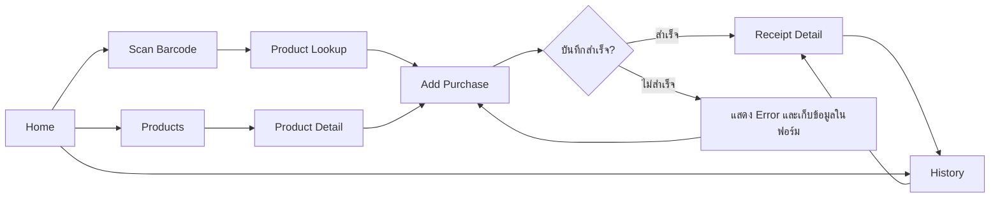

## 2. การค้นหาสินค้าด้วย UPC

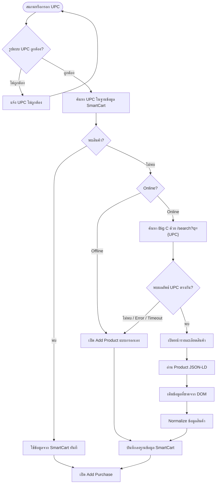

## 3. แหล่งข้อมูลและลำดับความน่าเชื่อถือ

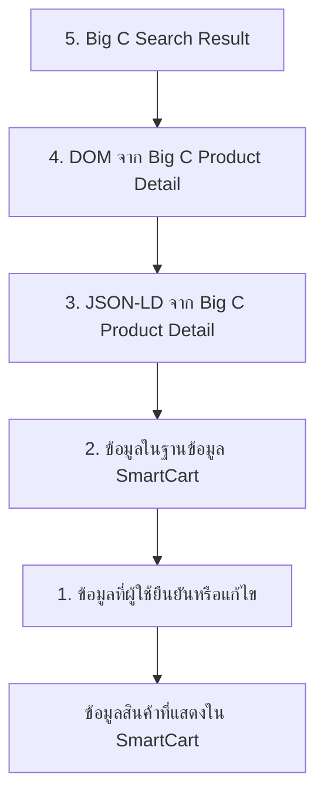

> ข้อมูลที่ผู้ใช้แก้ไขต้องไม่ถูกการ refresh จาก Big C เขียนทับโดยอัตโนมัติ

## 4. Product Lookup State

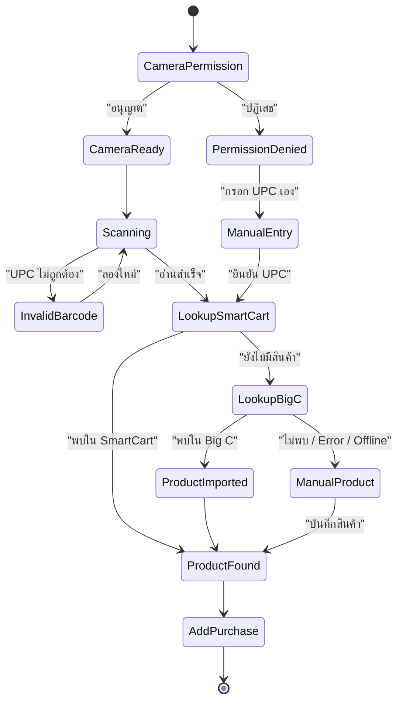

## 5. Add Purchase Flow

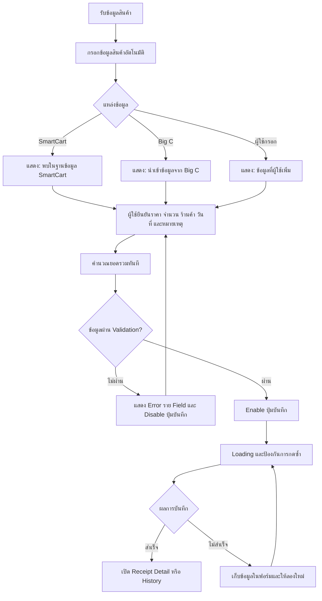

## 6. Add Purchase Field Mapping

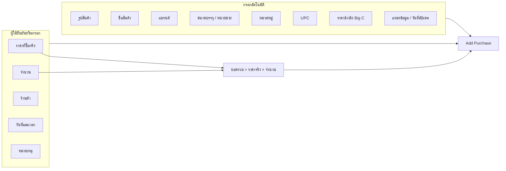

## 7. Screen Navigation

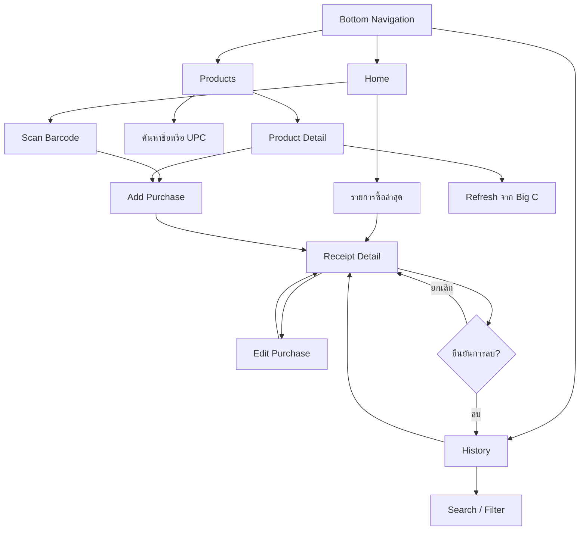

## 8. Error และ Fallback Flow

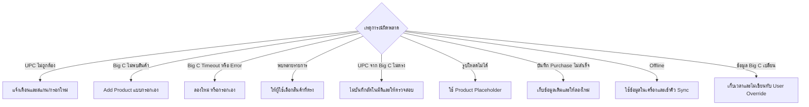

## 9. Local-first และ Sync

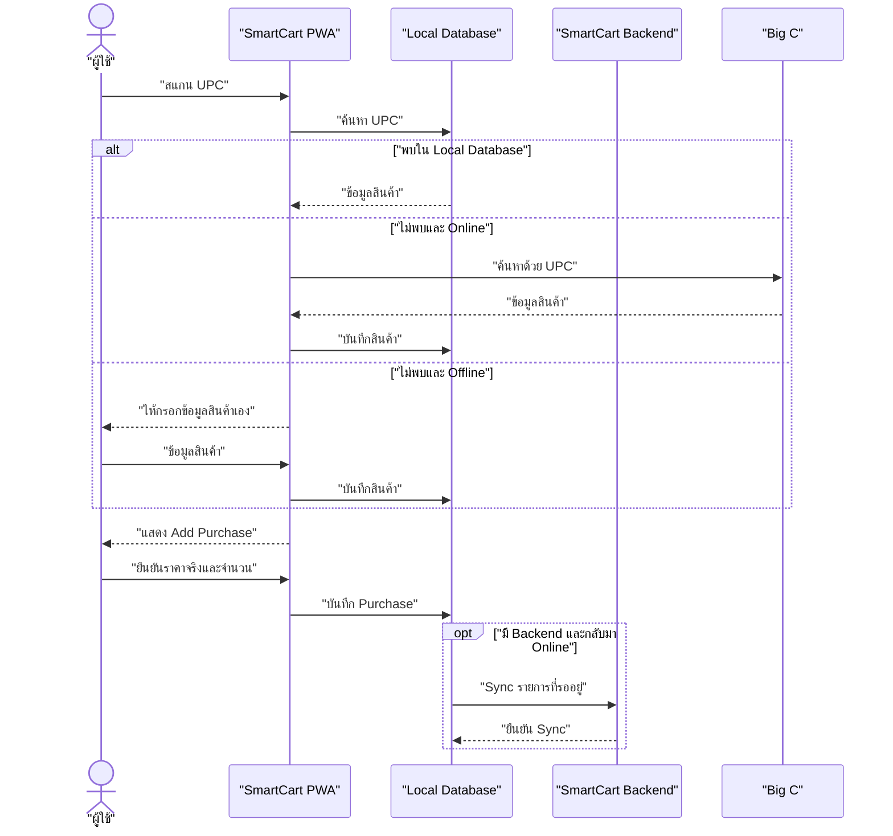

## 10. Data Relationship

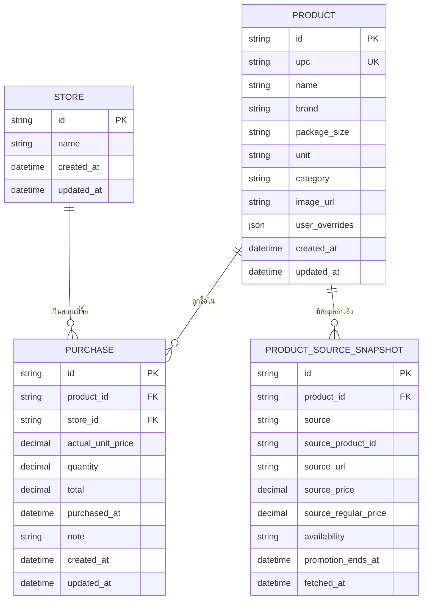

## 11. Definition of Done สำหรับลำดับ 1

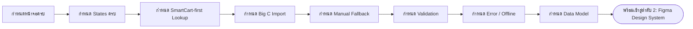

