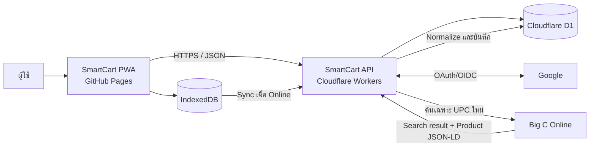
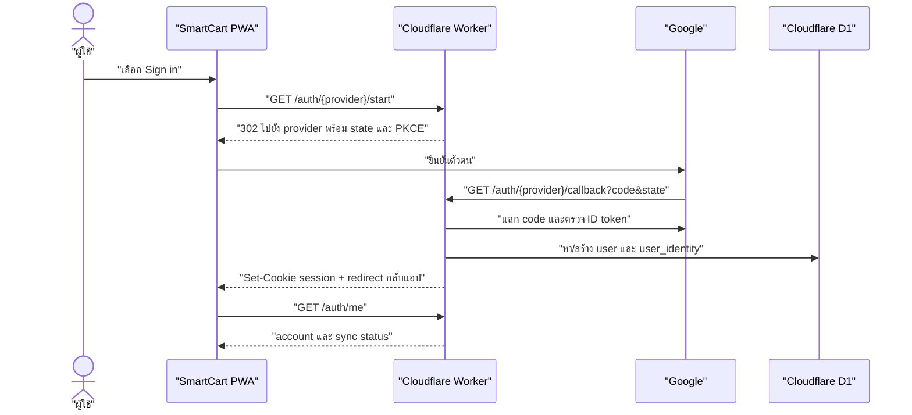
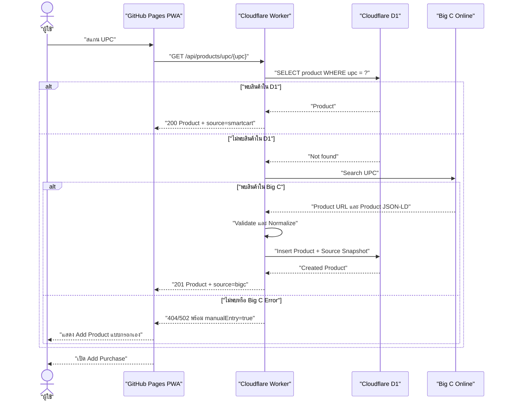
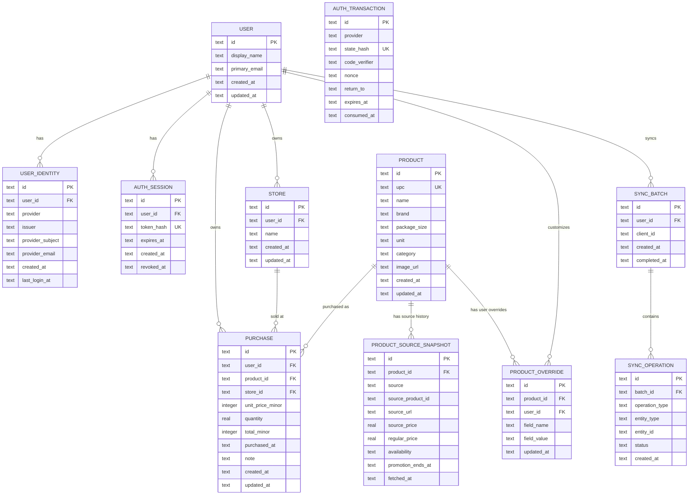
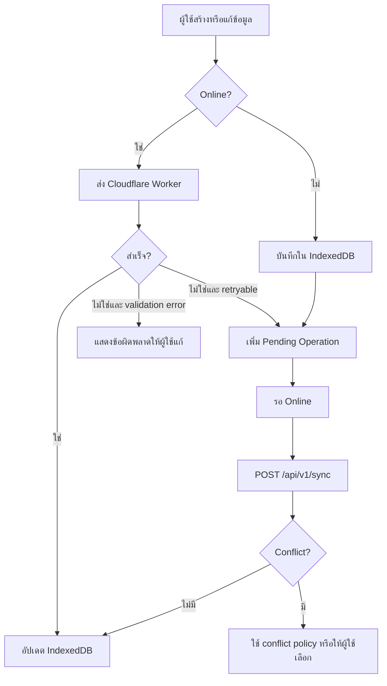
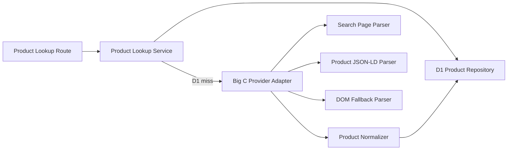
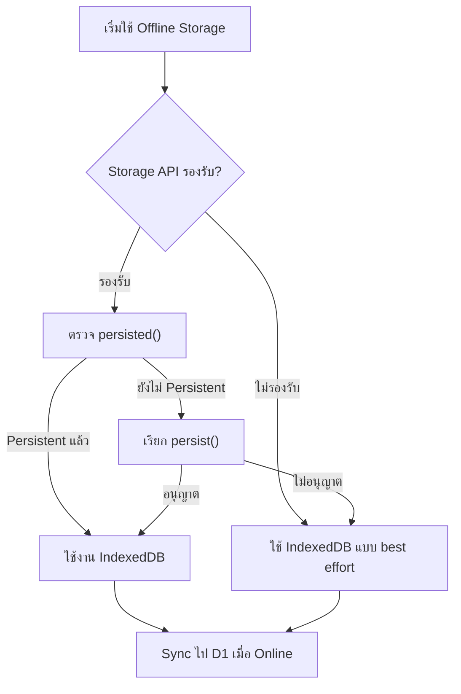

# SmartCart PWA — Architecture Summary

## 1. Technology Stack

| Layer | Technology | Responsibility |
|---|---|---|
| Frontend | GitHub Pages | Host SmartCart PWA และ static assets |
| Backend API | Cloudflare Workers | API, validation, product lookup, Big C integration และ business logic |
| Database | Cloudflare D1 | Products, purchases, stores, source snapshots และ sync metadata |
| Offline storage | IndexedDB | Cached products, purchases และรายการที่รอ sync ใน browser |
| Identity provider (Phase 2) | Google OpenID Connect | ยืนยันตัวตนและเชื่อมข้อมูลข้ามอุปกรณ์ |
| External product source | Big C Online | แหล่งข้อมูลสินค้าเมื่อพบ UPC ใหม่ |

## 2. System Architecture



## 3. Architectural Principles

1. Frontend เรียกเฉพาะ SmartCart API และไม่เรียก Big C โดยตรง
2. Cloudflare Workers เป็น boundary ของ business logic และ external integration
3. Cloudflare D1 เป็นแหล่งข้อมูลหลักของระบบหลังจากนำเข้าสินค้าครั้งแรก
4. ทุก product lookup ต้องค้น D1 ก่อน แล้วจึงค้น Big C เมื่อไม่พบ UPC
5. Frontend ใช้แนวทาง local-first เพื่อรองรับ offline
6. ราคาจาก Big C เป็นราคาอ้างอิง ผู้ใช้ต้องยืนยันราคาที่ซื้อจริง
7. ข้อมูลที่ผู้ใช้แก้ไขต้องไม่ถูก Big C refresh เขียนทับ
8. ทุก D1 query ต้องใช้ prepared statements และ parameter binding
9. Cloudflare D1 เป็น source of truth ของข้อมูลที่ sync สำเร็จ ส่วน IndexedDB เป็น offline cache และ pending queue
10. ข้อมูลที่ยังอยู่เฉพาะใน IndexedDB ถือว่ายังไม่สำรองถาวรและอาจสูญหายได้
11. Google ทำหน้าที่ยืนยันตัวตนเท่านั้น; SmartCart เป็นผู้สร้าง user, session และสิทธิ์เข้าถึงข้อมูลใน D1
12. ทุกรายการที่เป็นข้อมูลส่วนบุคคลต้องถูก scope ด้วย `user_id` ที่ Worker ได้จาก session เท่านั้น ห้ามรับ `user_id` จาก request body มาเชื่อถือโดยตรง

### 3.1 Authentication model

- Guest mode ยังคงใช้ได้สำหรับ local-first แต่จะไม่สามารถ sync ข้ามอุปกรณ์ได้
- ผู้ใช้ Sign in ผ่าน Google เพื่อสร้างหรือเชื่อม SmartCart account เดิม
- Worker ใช้ OAuth 2.0 / OpenID Connect Authorization Code flow พร้อม `state`, PKCE และ redirect URI ที่ลงทะเบียนไว้
- Worker ตรวจสอบ ID token ฝั่ง server ก่อนสร้าง session; frontend ต้องไม่ถือ provider token เป็น session ของ SmartCart
- Worker สร้าง session แบบ opaque token ใน cookie `HttpOnly`, `Secure`, `SameSite=Lax`; browser JavaScript ต้องอ่าน token ไม่ได้
- Session มีอายุจำกัดและสามารถ revoke ได้ด้วย Sign out
- เมื่อ Sign in แล้ว การ sync ข้อมูล Guest เข้า account ต้องให้ผู้ใช้ยืนยันก่อน



## 4. Product Lookup Flow



## 5. Component Responsibilities

### 5.1 GitHub Pages Frontend

- แสดง UI และ navigation
- สแกน UPC ผ่านกล้อง
- Form validation เพื่อ feedback ทันที
- เก็บ cached data และ pending operations ใน IndexedDB
- ตรวจจับ online/offline state
- เรียก SmartCart API ผ่าน HTTPS
- Sync pending operations เมื่อกลับมา online
- แสดงจำนวนรายการที่รอ sync และสถานะ `กำลังซิงก์`, `ซิงก์แล้ว` หรือ `ซิงก์ไม่สำเร็จ`
- เรียก `navigator.storage.persist()` เมื่อ API พร้อมใช้งาน และทำงานต่อได้หาก browser ไม่อนุญาต
- ตรวจสอบพื้นที่โดยประมาณด้วย `navigator.storage.estimate()` เมื่อ API พร้อมใช้งาน
- เริ่ม OAuth redirect และแสดง Sign in / Account state
- เก็บเฉพาะ client sync metadata ใน IndexedDB; ห้ามเก็บ session token แบบอ่านได้ด้วย JavaScript
- แสดงแหล่งข้อมูลและวันที่อัปเดตสินค้า
- รองรับ installable PWA

Frontend ต้องไม่รับผิดชอบ:

- Scrape Big C
- เชื่อม D1 โดยตรง
- เชื่อถือค่าราคา ยอดรวม หรือสิทธิ์ที่ส่งจาก browser โดยไม่ตรวจสอบซ้ำ

### 5.2 Cloudflare Workers API

- Routing และ API versioning
- CORS policy
- Request validation
- Product lookup ใน D1
- Big C search และ extraction
- ตรวจสอบ exact UPC match
- อ่าน Product JSON-LD เป็นแหล่งหลัก
- Normalize ข้อมูลสินค้า
- Business validation และคำนวณยอดรวมซ้ำที่ server
- CRUD products, purchases และ stores
- Conflict handling สำหรับ offline sync
- OAuth/OIDC start, callback, token validation, session creation และ logout
- ตรวจสอบ session และ derive `user_id` ก่อนเข้าถึงข้อมูลส่วนบุคคล
- ผูก provider subject (`iss` + `sub`) กับ SmartCart user โดยไม่ใช้ email เป็น identity key
- ป้องกัน CSRF, OAuth state replay และ session fixation
- Structured error responses
- Rate limiting และ observability

### 5.3 Cloudflare D1

- เก็บข้อมูลแบบ relational
- บังคับ unique UPC
- รักษาความสัมพันธ์ระหว่าง product, purchase และ store
- เก็บ SmartCart user, provider identity และ server-side session metadata
- เก็บ source snapshot แยกจาก user override
- ใช้ indexes สำหรับ UPC, purchase date, product และ store lookup
- ใช้ migrations สำหรับการเปลี่ยน schema
- ไม่เก็บไฟล์รูปภาพหรือ binary data โดยตรง

## 6. API Surface

Base path:

```text
/api/v1
```

### Authentication

| Method | Endpoint | Purpose |
|---|---|---|
| GET | `/auth/google/start` | เริ่ม Google OIDC flow |
| GET | `/auth/google/callback` | รับ Google authorization code และสร้าง session |
| GET | `/auth/me` | คืน account/session ปัจจุบัน |
| POST | `/auth/logout` | ยกเลิก session ปัจจุบัน |
| POST | `/auth/guest/claim` | ยืนยันและผูก pending Guest data กับ account ที่ sign in แล้ว |

### Products

| Method | Endpoint | Purpose |
|---|---|---|
| GET | `/products/upc/:upc` | ค้น D1 และ fallback ไป Big C เมื่อไม่พบ |
| POST | `/products/lookup` | Lookup ด้วย UPC จาก request body |
| GET | `/products` | ค้นหาและแบ่งหน้ารายการสินค้า |
| GET | `/products/:id` | Product detail และประวัติราคา |
| POST | `/products` | เพิ่มสินค้าด้วยข้อมูลผู้ใช้ |
| PATCH | `/products/:id` | แก้ข้อมูลสินค้าและสร้าง user override |
| POST | `/products/:id/refresh` | Refresh ข้อมูลอ้างอิงจาก Big C |

### Phase 3 implementation status

- `GET /api/v1/products/upc/:upc` และ `POST /api/v1/purchases` ถูกพัฒนาแล้ว
- Product lookup ใช้ D1-first และ import source snapshot จาก Big C เฉพาะเมื่อ UPC ไม่พบ
- เมื่อ Big C ตอบ bot challenge, upstream error หรือ structured data ไม่มี UPC ที่ตรงกัน ระบบตอบ `manualEntry: true`; ห้าม bypass ระบบป้องกันของเว็บไซต์
- หน้า Add Purchase ให้ผู้ใช้แก้ราคาจริง, จำนวน และร้านค้าก่อนบันทึก

### Purchases

| Method | Endpoint | Purpose |
|---|---|---|
| GET | `/purchases` | ประวัติ, search, filter และ pagination |
| GET | `/purchases/:id` | Receipt detail |
| POST | `/purchases` | บันทึกรายการซื้อ |
| PATCH | `/purchases/:id` | แก้ไขรายการซื้อ |
| DELETE | `/purchases/:id` | ลบรายการซื้อ |

### Stores และ Sync

| Method | Endpoint | Purpose |
|---|---|---|
| GET | `/stores` | ค้นร้านค้าและร้านล่าสุด |
| POST | `/stores` | เพิ่มร้านค้า |
| POST | `/sync` | ส่ง pending offline operations แบบ batch |
| GET | `/health` | Health check ของ Worker |

## 7. Standard API Response

### Success

```json
{
  "data": {},
  "meta": {
    "requestId": "...",
    "source": "smartcart"
  }
}
```

### Error

```json
{
  "error": {
    "code": "PRODUCT_NOT_FOUND",
    "message": "ไม่พบสินค้า",
    "details": {},
    "retryable": false
  },
  "meta": {
    "requestId": "..."
  }
}
```

Suggested status codes:

| Status | Use |
|---|---|
| 200 | อ่านหรือแก้ไขสำเร็จ |
| 201 | สร้าง product หรือ purchase สำเร็จ |
| 400 | Request หรือ UPC ไม่ถูกต้อง |
| 404 | ไม่พบ resource หรือ Big C ไม่พบสินค้า |
| 409 | UPC ซ้ำหรือ sync conflict |
| 422 | Business validation ไม่ผ่าน |
| 429 | Request มากเกินกำหนด |
| 500 | Internal error |
| 502 | Big C upstream error |
| 504 | Big C timeout |

## 8. D1 Data Model



### Data rules

- `products.upc` ต้องเป็น unique
- `user_identities(provider, issuer, provider_subject)` ต้องเป็น unique และใช้เป็น identity key ที่เชื่อถือได้
- `auth_sessions.token_hash` เก็บ hash ของ opaque session token เท่านั้น ห้ามเก็บ raw session token ใน D1
- `auth_transactions.state_hash` เก็บเฉพาะ hash ของ OAuth state, ใช้ครั้งเดียว และหมดอายุใน 10 นาที
- purchases, stores, overrides และ sync batches ต้องมี `user_id`; Worker เติมค่านี้จาก session
- เงินควรเก็บเป็นจำนวนหน่วยย่อยแบบ integer เช่น satang เพื่อลดปัญหา floating point
- วันที่เก็บเป็น ISO 8601 UTC text และแปลง timezone ที่ frontend
- Boolean ใน D1 ใช้ integer `0/1`
- ใช้ foreign keys และกำหนด delete behavior ให้ชัดเจน
- ใช้ prepared statements กับ `.bind()` ทุก query
- ใช้ D1 batch เมื่อมีหลาย statement ที่ต้องทำร่วมกัน
- ใช้ write/read pattern ที่รักษา read-after-write consistency เมื่อ response ต้องคืนข้อมูลที่เพิ่งสร้าง

## 9. Suggested Indexes

```text
UNIQUE products(upc)
INDEX purchases(purchased_at)
INDEX purchases(product_id, purchased_at)
INDEX purchases(store_id, purchased_at)
INDEX product_source_snapshots(product_id, fetched_at)
INDEX stores(name)
INDEX stores(user_id, name)
UNIQUE user_identities(provider, issuer, provider_subject)
INDEX auth_sessions(token_hash, expires_at)
INDEX purchases(user_id, purchased_at)
INDEX sync_batches(user_id, created_at)
INDEX sync_operations(batch_id, status)
```

## 10. Offline and Sync Strategy



### Sync requirements

- ทุก mutation มี client-generated UUID เป็น `operationId` เพื่อรองรับ idempotency
- แนะนำ UUID v4 ผ่าน `crypto.randomUUID()` และต้องมี fallback สำหรับ browser ที่ไม่รองรับ
- `operationId` ต้องคงเดิมเมื่อ retry operation เดิม ห้ามสร้าง UUID ใหม่ทุกครั้งที่ retry
- Worker ต้องไม่สร้างข้อมูลซ้ำเมื่อ retry request เดิม
- Sync แบบ batch และคืนผลแยกต่อ operation
- Validation error ไม่ควร retry อัตโนมัติ
- Network, timeout และ temporary upstream error retry ได้แบบจำกัด
- Product ที่ import จาก Big C ไม่ต้อง block offline purchase flow
- เมื่อมี pending operation อย่างน้อยหนึ่งรายการ UI ต้องแจ้งผู้ใช้ว่า “รอซิงก์” พร้อมจำนวนรายการ
- เมื่อกลับมา online ให้เริ่ม sync โดยอัตโนมัติ และมีปุ่มให้ผู้ใช้สั่งลองใหม่ได้
- หลัง sync สำเร็จ ให้เก็บข้อมูลใน IndexedDB เป็น cache แต่เปลี่ยนสถานะ operation เป็น synced หรือลบออกจาก pending queue
- ห้ามแสดงว่าข้อมูล “บันทึกถาวรแล้ว” จนกว่า Worker จะยืนยันว่าบันทึกเข้า D1 สำเร็จ

### Pending sync UX

| State | UI message | Allowed action |
|---|---|---|
| `pending` | `บันทึกในเครื่องแล้ว · รอซิงก์` | ดูหรือแก้ไขข้อมูล และกดซิงก์เมื่อ online |
| `syncing` | `กำลังซิงก์…` | ใช้งานส่วนอื่นต่อได้ |
| `synced` | `ซิงก์แล้ว` | ไม่มี action ที่จำเป็น |
| `retryable_error` | `ยังซิงก์ไม่สำเร็จ` | กดลองใหม่ |
| `conflict` | `ต้องตรวจสอบข้อมูลก่อนซิงก์` | เปิดหน้าจอแก้ conflict |
| `validation_error` | `ข้อมูลไม่ครบหรือไม่ถูกต้อง` | แก้ไขรายการก่อนส่งใหม่ |

## 11. Big C Integration Boundary



Big C integration ต้องแยกเป็น provider adapter เพื่อให้:

- เปลี่ยน selector หรือ parsing logic ได้โดยไม่กระทบ API routes
- เพิ่มแหล่งข้อมูลอื่นในอนาคตได้
- ทดสอบ parser ด้วย saved fixtures ได้
- ปิด provider ชั่วคราวได้เมื่อ upstream มีปัญหา
- จำกัด timeout, retry และ request rate ได้จากจุดเดียว

## 12. Security

- อนุญาต CORS เฉพาะ production GitHub Pages origin และ localhost ที่กำหนดใน development
- ตอบ `OPTIONS` preflight ให้ถูกต้อง
- Validate UPC, request body, pagination และ filter ที่ Worker
- ใช้ prepared statements ป้องกัน SQL injection
- จำกัด request body size
- เพิ่ม rate limiting ที่ product lookup และ Big C refresh
- จำกัด rate ที่ auth start/callback และป้องกัน OAuth callback replay
- ใช้ `state` แบบ single-use และ PKCE (`S256`) สำหรับ OAuth authorization code flow
- Validate ID token: issuer, audience, expiry, signature และ nonce เมื่อ provider ส่งมา
- ใช้ `HttpOnly`, `Secure`, `SameSite=Lax` สำหรับ SmartCart session cookie
- เก็บเพียง hash ของ session token ใน D1 และ rotate/revoke session เมื่อ Sign out
- บังคับ authorization filter ด้วย session-derived `user_id` ในทุก query ที่เป็นข้อมูลผู้ใช้
- ไม่ส่ง stack trace หรือข้อมูลภายในกลับ client
- ใช้ request ID สำหรับ trace
- เก็บ Google OAuth client credentials ใน Cloudflare Worker Secrets ไม่ใส่ใน repository
- เพิ่ม security headers ใน API responses
- ตรวจสอบ Big C response ก่อนบันทึกทุกครั้ง

### Provider configuration

| Provider | สิ่งที่ต้องตั้งค่า | Secret ที่เก็บใน Worker |
|---|---|---|
| Google | Google Cloud OAuth client และ callback redirect URI | `GOOGLE_CLIENT_ID`, `GOOGLE_CLIENT_SECRET` |

Client IDs, callback URL และ allowed origin เป็น configuration ที่เปิดเผยได้ตามจำเป็น ส่วน private key และ client secret ต้องเป็น Worker Secret เท่านั้น ตาม [Cloudflare Workers Secrets](https://developers.cloudflare.com/workers/configuration/secrets/)

## 13. GitHub Pages Constraints

- GitHub Pages ให้บริการ static files เท่านั้น
- API base URL ต้องชี้ไปยัง Cloudflare Worker domain
- หากใช้ SPA routing ต้องมี fallback strategy หรือใช้ hash routing
- `manifest.webmanifest`, service worker และ icons ต้องใช้ path ที่รองรับ repository subpath
- `manifest.webmanifest` ต้องตั้ง `display: "standalone"` เพื่อให้การเปิดจาก Home Screen ทำงานใน standalone web app context
- กำหนด `start_url` และ `scope` ให้สอดคล้องกับ GitHub Pages repository subpath
- CORS origin ต้องตรงกับ GitHub Pages URL จริง
- ห้ามฝัง secret หรือข้อมูลลับใน frontend build
- Service worker caching ต้องไม่ cache API mutation แบบถาวร
- สำหรับ Google session ใน production ให้ผูก GitHub Pages กับ custom domain เช่น `app.example.com` และผูก Worker กับ `api.example.com` ใต้โดเมนหลักเดียวกัน; เป็น same-site ทำให้ cookie `SameSite=Lax` ใช้งานได้บน Safari
- `github.io` ร่วมกับ `workers.dev` เป็นคนละ site และไม่ควรใช้แทน custom-domain setup สำหรับ cookie session

ตัวอย่าง manifest ขั้นต่ำ:

```json
{
  "name": "SmartCart",
  "short_name": "SmartCart",
  "start_url": "./",
  "scope": "./",
  "display": "standalone",
  "background_color": "#F8FAF9",
  "theme_color": "#0F945C"
}
```

## 14. iPhone, Safari and Storage Requirements

IndexedDB รองรับบน iPhone แต่ต้องถือเป็นพื้นที่เก็บข้อมูลฝั่ง client ที่อาจถูกล้าง ไม่ใช่ฐานข้อมูลถาวรเพียงแห่งเดียว

### Storage policy

- Cloudflare D1 เป็น source of truth สำหรับข้อมูลที่ sync สำเร็จ
- IndexedDB ใช้สำหรับ offline cache, optimistic local data และ pending sync queue
- ข้อมูล offline อาจสูญหายจาก storage pressure, quota, การล้างข้อมูลเว็บไซต์, Private Browsing หรือพฤติกรรมการจัดการ storage ของระบบ
- ห้ามรับประกันว่า “ข้อมูล offline จะไม่สูญหาย” จนกว่า API จะยืนยันว่าข้อมูลถูกบันทึกเข้า D1 แล้ว
- Safari 17 และ iOS 17 เป็นต้นไปรองรับ Storage API และ quota policy ที่ดีขึ้น แต่ข้อมูลยังมีโอกาสถูก eviction ภายใต้ storage pressure
- อ้างอิง: [WebKit — Safari 17 Storage API](https://webkit.org/blog/14445/webkit-features-in-safari-17-0/) และ [WebKit — Updates to Storage Policy](https://webkit.org/blog/14403/updates-to-storage-policy/)

### Persistent storage request

เมื่อเริ่มใช้งาน offline feature หรือหลังผู้ใช้บันทึกรายการแรก ให้ frontend:

1. ตรวจ `navigator.storage` และ `navigator.storage.persist`
2. ตรวจสถานะเดิมด้วย `navigator.storage.persisted()` หากรองรับ
3. เรียก `navigator.storage.persist()` ผ่าน user journey ที่เหมาะสม
4. เก็บผลลัพธ์เพื่อใช้แสดงสถานะ แต่ห้าม block การใช้งานเมื่อไม่ได้รับอนุญาต
5. หาก API ไม่มีหรือคืนค่า `false` ให้ใช้ IndexedDB ต่อได้ พร้อมถือว่าข้อมูลยังเสี่ยงถูกล้าง
6. แจ้งเตือนเฉพาะเมื่อมี pending data ที่ยังไม่ sync ไม่ควรรบกวนผู้ใช้ทุกครั้งที่เปิดแอป



### Required iPhone test matrix

| Scenario | Safari tab | Home Screen standalone |
|---|---:|---:|
| เปิดและอ่าน IndexedDB | Required | Required |
| สร้าง purchase ขณะ offline | Required | Required |
| ปิดและเปิดแอปใหม่ก่อน sync | Required | Required |
| กลับมา online แล้ว auto-sync | Required | Required |
| แสดง pending-sync indicator | Required | Required |
| `persist()` คืน `true` | Test when available | Test when available |
| `persist()` คืน `false` หรือ API ไม่มี | Required | Required |
| Storage quota/error | Required | Required |
| Service worker update | Required | Required |
| ล้าง website data แล้ว recovery | Required | Required |

Safari tab และ Home Screen web app ต้องทดสอบแยกกัน เพราะ lifecycle และ storage context อาจมีพฤติกรรมต่างกัน ห้ามถือว่าผลจากโหมดหนึ่งแทนอีกโหมดได้

## 15. Environments

| Environment | Frontend | Worker | D1 |
|---|---|---|---|
| Local | Local dev server | Wrangler local dev | Local D1 state |
| Staging | Staging GitHub Pages URL/branch | Staging Worker | Staging D1 |
| Production | Production GitHub Pages | Production Worker | Production D1 |

ข้อกำหนด:

- แยก D1 staging และ production
- ใช้ migration ชุดเดียวกันทุก environment
- ทดสอบ migration ใน staging ก่อน production
- ตั้ง CORS origin แยกตาม environment
- ไม่ใช้ production D1 ใน automated tests
- ใช้ OAuth callback URL และ client credentials แยกสำหรับ local, staging และ production
- ห้ามใช้ Google production credentials ใน local test

## 16. Observability

- Structured logs พร้อม request ID
- บันทึก endpoint, status, latency และ error code
- แยก latency ของ D1 และ Big C lookup
- วัด D1 hit rate เทียบกับ Big C import rate
- วัด product-not-found, upstream error และ timeout
- ห้าม log ข้อมูลลับหรือ payload ที่ไม่จำเป็น

Suggested metrics:

```text
api_requests_total
api_request_duration_ms
product_lookup_d1_hit_total
product_lookup_bigc_total
product_lookup_not_found_total
bigc_request_duration_ms
bigc_error_total
purchase_created_total
sync_operations_total
sync_conflict_total
pending_sync_operations
storage_persist_granted_total
storage_persist_denied_total
auth_login_started_total
auth_login_succeeded_total
auth_login_failed_total
auth_provider_linked_total
```

## 17. Deployment Flow


## 18. Architecture Decisions

| Decision | Status | Reason |
|---|---|---|
| GitHub Pages สำหรับ frontend | Confirmed | เหมาะกับ static PWA |
| Cloudflare Workers สำหรับ API | Confirmed | แยก server logic และ Big C integration ออกจาก browser |
| Cloudflare D1 สำหรับ relational data | Confirmed | เหมาะกับ product, purchase และ store relationships |
| IndexedDB สำหรับ offline | Recommended | รองรับ local-first และ pending sync |
| D1 เป็น source of truth | Confirmed | IndexedDB อาจถูกล้างและใช้เป็น cache/queue เท่านั้น |
| UUID ต่อ mutation | Confirmed | ป้องกันข้อมูลซ้ำเมื่อ retry และรองรับ idempotency |
| Pending-sync indicator | Confirmed | ผู้ใช้ต้องทราบว่าข้อมูลยังไม่ถูกบันทึกถาวร |
| Persistent storage request | Confirmed with fallback | ขอผ่าน Storage API แต่ห้ามพึ่งพาว่าจะได้รับอนุญาต |
| PWA `display: standalone` | Confirmed | รองรับ Home Screen web app บน iPhone |
| Safari และ Home Screen test | Required | ทั้งสองโหมดอาจมี lifecycle/storage behavior ต่างกัน |
| Google Sign in | Implemented in Phase 2 | OIDC ผ่าน Cloudflare Worker เพื่อเชื่อมข้อมูลข้ามอุปกรณ์ |
| Apple Sign in | Deferred | ไม่อยู่ในขอบเขตของ Phase 2 |
| Guest mode | Confirmed | ใช้งาน local-first ต่อได้ และเลือก claim data หลัง Sign in |
| SmartCart/D1-first product lookup | Confirmed | ลดการเรียก Big C ซ้ำ |
| JSON-LD เป็น Big C source หลัก | Confirmed | เสถียรกว่า DOM selector |
| Big C provider adapter | Recommended | ลด coupling และรองรับ source อื่นภายหลัง |
| R2 สำหรับรูปสินค้า | Deferred | เริ่มด้วย URL ต้นทางก่อน แล้วประเมินภายหลัง |

## 19. Definition of Done

- Architecture และ responsibility ของแต่ละ layer ชัดเจน
- Frontend ไม่เรียก Big C หรือ D1 โดยตรง
- API routes และ standard response ถูกกำหนด
- D1 entities, relationships และ indexes ถูกกำหนด
- Offline queue, idempotency และ conflict direction ถูกกำหนด
- ทุก mutation ใช้ UUID และ retry ด้วย operation ID เดิม
- UI แสดงจำนวนและสถานะรายการที่รอ sync
- Storage API persistent request มี fallback เมื่อ API ไม่มีหรือไม่ได้รับอนุญาต
- PWA manifest ใช้ `display: "standalone"`
- มี test matrix แยก Safari tab และ Home Screen standalone บน iPhone
- เอกสารระบุชัดว่า IndexedDB อาจถูกล้าง และ D1 เป็น source of truth
- ห้ามแจ้งว่าข้อมูลบันทึกถาวรจนกว่า D1 จะยืนยันการ sync
- Google login มี OAuth/OIDC flow, session policy, API routes และ D1 entities กำหนดครบ
- ทุกข้อมูลส่วนบุคคลถูก scope ด้วย `user_id` จาก session ที่ Worker ตรวจสอบแล้ว
- Guest data ถูก claim เข้า account ได้โดยมีผู้ใช้ยืนยันก่อน
- OAuth secrets ไม่อยู่ใน GitHub Pages build หรือ repository
- ตั้งค่า Google redirect URI แยกตาม environment ก่อน deploy
- Big C integration แยกเป็น provider adapter
- Security, CORS และ environment boundaries ถูกกำหนด
- Deployment และ observability direction ถูกกำหนด
- พร้อมเข้าสู่ขั้นออกแบบ D1 schema, API contract และ Figma states รายละเอียด

