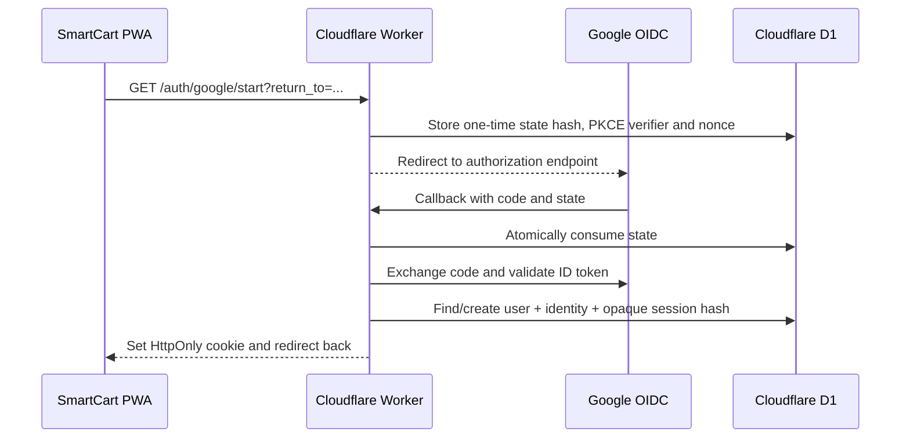

# Phase 2 — Google Login

Phase 2 adds Google OpenID Connect login only. Apple Login is not implemented.

## Implemented flow



The Worker validates the Google ID token signature, issuer, audience and nonce. The browser never receives a SmartCart session token in JavaScript; only its opaque-token hash is stored in D1.

## Local setup

1. Copy `apps/api/.dev.vars.example` to `apps/api/.dev.vars` and add a Google OAuth client ID and client secret.
2. In Google Cloud, register `http://localhost:8787/auth/google/callback` as an authorized redirect URI.
3. Apply local migrations:

   ```bash
   npx wrangler d1 migrations apply smartcart-local --local
   ```

4. Run the API and PWA in separate terminals:

   ```bash
   npm run dev:api
   npm run dev:web
   ```

## Production setup

1. Use custom domains under one parent domain: `app.example.com` for GitHub Pages and `api.example.com` for the Worker.
2. Replace the placeholder `APP_ORIGIN` and `API_ORIGIN` values in `apps/api/wrangler.jsonc`.
3. Register `https://api.example.com/auth/google/callback` in Google Cloud.
4. Configure `GOOGLE_CLIENT_ID` and `GOOGLE_CLIENT_SECRET` as Worker secrets for each environment.
5. Set GitHub Actions variable `VITE_API_ORIGIN=https://api.example.com` before deploying the PWA.

The custom-domain requirement keeps the PWA and API same-site, so the `HttpOnly; SameSite=Lax` cookie works predictably on Safari. Do not treat a `github.io` PWA and a `workers.dev` API as equivalent for cookie sessions.

## Verification completed

- Worker typecheck passed.
- Worker integration tests passed (health and anonymous `/auth/me`).
- React production build and Worker dry-run build passed.
- Both D1 migrations applied successfully in local D1 state.

End-to-end sign-in still requires user-owned Google OAuth credentials and registered redirect URIs.

