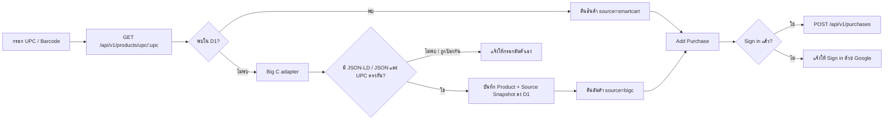

# Phase 3 — Product Lookup และ Add Purchase

## สิ่งที่พัฒนาแล้ว

- หน้า PWA เพิ่มช่อง UPC, ผลการค้นหา, แบบฟอร์มเพิ่มสินค้าเอง และ Add Purchase
- `GET /api/v1/products/upc/:upc` ค้น D1 ก่อนเสมอ
- เมื่อ D1 ไม่พบ ระบบเรียก Big C search URL และอ่านเฉพาะ structured JSON-LD / JSON ที่เผยแพร่ในหน้า
- ระบบตรวจว่าบาร์โค้ดตรงกับ UPC ที่ค้นหาก่อน import และบันทึก product พร้อม Big C source snapshot ใน D1
- การค้นหาครั้งต่อไปดึงจาก D1 โดยไม่เรียก Big C ซ้ำ
- `POST /api/v1/purchases` บันทึกราคา จำนวน ร้านค้า และยอดรวมที่คำนวณฝั่ง Worker
- การบันทึก purchase ต้องมี Google session และ Worker เป็นผู้ได้ `user_id` จาก session

## Big C fallback ที่ปลอดภัย

หน้า Big C ตัวอย่างปัจจุบันตอบกลับด้วย bot challenge ต่อคำขออัตโนมัติ จึงไม่มีการพยายามข้ามระบบป้องกันนั้น ระบบจะตอบ `BIGC_UNAVAILABLE` พร้อม `manualEntry: true` เพื่อให้ผู้ใช้กรอกสินค้าเองหรือกดลองใหม่ภายหลัง แทนการบันทึกข้อมูลไม่ครบหรือคลาดเคลื่อนลงฐานข้อมูล

## API ที่พร้อมใช้

| Method | Endpoint | ผลลัพธ์ |
|---|---|---|
| GET | `/api/v1/products/upc/:upc` | `200` สินค้าจาก D1/Big C, `404` ไม่พบ, `502` Big C ใช้งานไม่ได้ |
| POST | `/api/v1/products` | เพิ่มสินค้าเองหลัง Sign in เมื่อ lookup ไม่สำเร็จ |
| POST | `/api/v1/purchases` | `201` บันทึกรายการซื้อ, `401` ยังไม่ได้เข้าสู่ระบบ |

UPC ที่รองรับ: 8, 12, 13 หรือ 14 หลัก

การเพิ่มสินค้าเองและการบันทึก purchase ต้องเข้าสู่ระบบด้วย Google ก่อน

## การตรวจสอบที่ผ่านแล้ว

- Product parser ยอมรับเฉพาะ UPC ที่ตรงกัน
- Product ที่มีใน D1 ถูกคืนทันทีโดยไม่เรียก Big C ซ้ำ
- Add Purchase ปฏิเสธคำขอที่ไม่มี session
- Integration tests ผ่าน 7 tests
- React production build และ Worker dry-run build ผ่าน

การ query D1 ใช้ prepared statements และ parameter binding ตาม [Cloudflare D1 documentation](https://developers.cloudflare.com/d1/worker-api/prepared-statements/)

