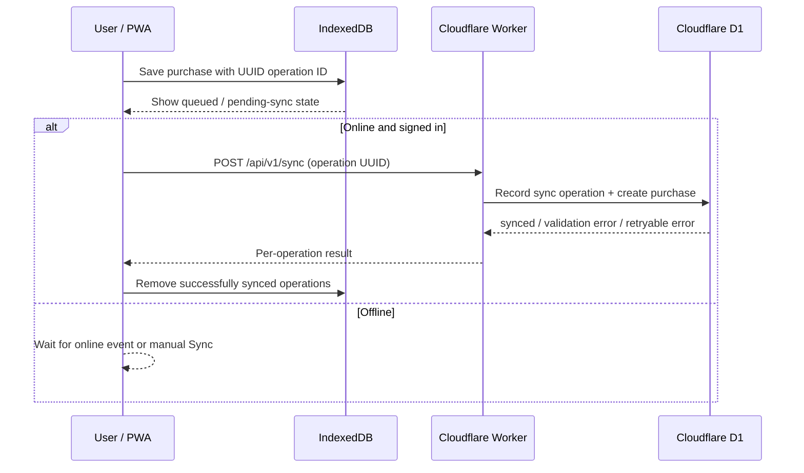

# SmartCart — Phase 4: Offline-first & D1 Sync

## Result

Phase 4 makes Add Purchase offline-first. The browser writes each purchase to IndexedDB first, then synchronizes it to Cloudflare D1 when a signed-in user is online. D1 remains the source of truth after a successful sync.

## Implemented

- Cache products by UPC in IndexedDB, so a previously looked-up product can be selected while offline.
- Queue every new purchase locally before attempting network synchronization.
- Generate a UUID for each queued operation and use that UUID as the purchase ID in D1. Retrying an operation cannot create a duplicate purchase.
- Add `POST /api/v1/sync`, with an operation limit, body-size limit, payload validation, and a server-side operation ledger in `sync_batches` / `sync_operations`.
- Bind an operation ID to the account that first submitted it; another account cannot observe or retry it.
- Automatically retry when the browser emits `online`, retry on sign-in, and offer a manual “ซิงก์ตอนนี้” button.
- Show online/offline state and the count of unsynchronized records.
- Request persistent browser storage through `navigator.storage.persist()` after a local purchase is queued. The app clearly warns if the browser declines it.
- Keep `display: "standalone"` in the PWA manifest for Home Screen installation.

## Intentional limits

- Offline product search only works for products already cached on that device. Creating a new manual product still requires online access.
- A queued record is not guaranteed durable until it has synchronized to D1. Browser storage can be evicted under storage pressure, especially if persistent storage is not granted.
- `navigator.storage.persist()` is a request, not a guarantee. The browser may decline it.
- Big C retrieval is unchanged from Phase 3: it uses public product content when available and does not bypass bot protection.

## Verification completed

| Check | Result |
|---|---|
| `npm run typecheck` | Passed |
| `npm test` | Passed — 9 tests, including a retry that confirms one UUID creates only one purchase |
| `npm run build` | Passed — web production bundle and Worker dry-run |

The local test runtime reports a non-blocking warning: installed Miniflare supports compatibility dates through `2025-09-06`, so it falls back from the configured `2026-09-01` during local tests. Wrangler's Worker dry-run succeeds with the configured date.

## Required device QA before release

1. In Safari on iPhone, sign in, look up a product, turn on Airplane Mode, add a purchase, then confirm the queue count increases.
2. Re-enable connectivity and confirm the queue count returns to zero and exactly one purchase appears in D1.
3. Repeat while opened from the Home Screen, not only Safari. These contexts can have different storage behavior.
4. In browser settings, deny or clear site data and verify the app’s pending-sync warning is understandable. Do not claim an offline record is safe before D1 confirms sync.
5. Test an expired Google session: the queue must remain local and the UI must request a fresh sign-in before sync.

## References

- [MDN: IndexedDB API](https://developer.mozilla.org/en-US/docs/Web/API/IndexedDB_API)
- [MDN: StorageManager.persist()](https://developer.mozilla.org/en-US/docs/Web/API/StorageManager/persist)
- [WebKit: Safari 17 storage update](https://webkit.org/blog/14445/webkit-features-in-safari-17-0/)
- [Cloudflare D1 Worker API](https://developers.cloudflare.com/d1/worker-api/d1-database/)

