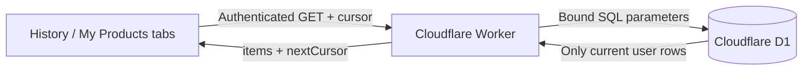

# SmartCart — Phase 6: History & Products

## Result

เพิ่มสองพื้นที่สำหรับผู้ใช้ที่ล็อกอินแล้ว:

- **ประวัติรายการซื้อ** — เรียงจากใหม่ไปเก่า, ค้นหาด้วยชื่อสินค้า / UPC / ร้านค้า, และโหลดเพิ่มทีละ 20 รายการ
- **สินค้าของฉัน** — รวมสินค้าที่ผู้ใช้เคยซื้อ, แสดงจำนวนครั้งที่ซื้อ, ยอดใช้จ่ายสะสม และวันที่ซื้อล่าสุด

## API

| Endpoint | Purpose |
|---|---|
| `GET /api/v1/purchases?limit=20&q=&cursor=` | Purchase history of the signed-in user |
| `GET /api/v1/products/mine?limit=20&q=&cursor=` | Aggregated products purchased by the signed-in user |

Both endpoints require the Google session cookie. `limit` is validated from 1 to 50, searches are limited to 80 characters, cursor values are validated, and every user-controlled query value is bound rather than inserted into SQL text.

## Privacy and pagination

- Purchase queries always include the current `user_id`; another account's purchases and product totals are never returned.
- Cursor pagination uses `(purchased_at, id)` ordering, avoiding offset scans and duplicate items as more data is loaded.
- Product aggregation is based only on the signed-in user’s purchases, even though the product record itself is shared for UPC lookup.

## UI behavior

- The app has three tabs: **Add Purchase**, **ประวัติ**, and **สินค้าของฉัน**.
- Search is submitted explicitly, then reloads from the first page.
- “ดูรายการเพิ่มเติม” / “ดูสินค้าเพิ่มเติม” uses the next cursor from the API.
- These two read views require network access to D1. Offline purchase capture and sync behavior from the prior phase remain unchanged.

## Verification completed

| Check | Result |
|---|---|
| `npm run typecheck` | Passed |
| `npm test` | Passed — 11 tests |
| `npm run build` | Passed — web production build and Worker dry-run |

The integration tests cover search, user isolation, and per-user product aggregation. Local Miniflare still warns that it falls back from compatibility date `2026-09-01` to `2025-09-06`; deployment dry-run succeeds with the configured Worker date.

## Reference

[Cloudflare D1 Worker API](https://developers.cloudflare.com/d1/worker-api/d1-database/) documents D1 prepared statements and bound parameters used by these endpoints.

