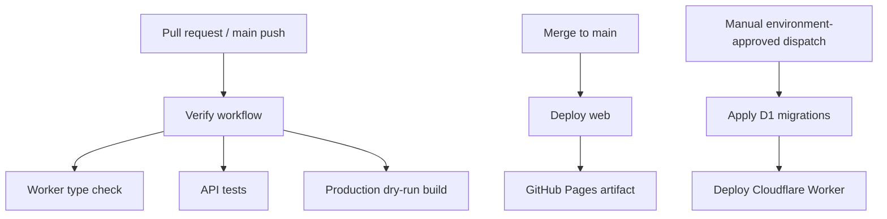

# SmartCart — Phase 7: QA & Release Readiness

## Result

The project is ready for controlled release automation. No production service was deployed because the required Cloudflare account, D1 IDs, domains, Google OAuth credentials, and GitHub environment secrets are intentionally outside this workspace.

## Added safeguards

- `Verify` GitHub Actions workflow runs generated Worker binding validation, type checking, API tests, and a production build dry run.
- `Deploy web` deploys only `apps/web/dist` to GitHub Pages. It fails if `VITE_API_ORIGIN` was not configured.
- `Deploy API` can only be started manually and is serialised per `staging`/`production` environment. It applies D1 migrations before Worker deployment.
- Production Worker responses add HSTS, while all Worker responses add permissions and cross-origin-resource policy headers.
- Worker environment configuration declares Google credentials as required secrets for staging and production. The source code and configuration never contain their values.
- The service worker now caches same-origin app assets after they are fetched and uses a network-first navigation fallback for the app shell.

## Required release setup

1. Replace all D1 IDs and `YOUR_DOMAIN` placeholders in `apps/api/wrangler.jsonc`.
2. Configure same-site domains for the app and API, then add the API Worker Custom Domain in Cloudflare.
3. Add Google redirect URIs and set both Worker Google secrets interactively.
4. Configure GitHub variables `VITE_API_ORIGIN` and, for a custom Pages domain, `VITE_BASE_PATH=/`.
5. Store `CLOUDFLARE_API_TOKEN` in GitHub `staging` and `production` environments and add protection rules for production.
6. In GitHub Pages settings, select **GitHub Actions** as the publishing source.

The full operator sequence and iPhone/Safari QA checklist are in the repository [README](../README.md).

## Verification completed

| Check | Result |
|---|---|
| Worker types current | Passed |
| `npm run typecheck` | Passed |
| `npm test` | Passed |
| `npm run build` | Passed |

## Operational notes

- The API Worker is intended to run on a Custom Domain such as `api.example.com`; Cloudflare recommends Custom Domains when a Worker is the hostname origin.
- GitHub Pages deploys through the documented Actions artifact flow with a protected `github-pages` environment.
- Local Miniflare still falls back from compatibility date `2026-09-01` to `2025-09-06`; this is a local-runtime limitation. Wrangler production dry-run succeeds with the configured date.

## References

- [GitHub Pages custom workflows](https://docs.github.com/en/pages/getting-started-with-github-pages/using-custom-workflows-with-github-pages)
- [Cloudflare Worker Custom Domains](https://developers.cloudflare.com/workers/configuration/routing/custom-domains/)
- [Cloudflare Wrangler configuration](https://developers.cloudflare.com/workers/wrangler/configuration/)

